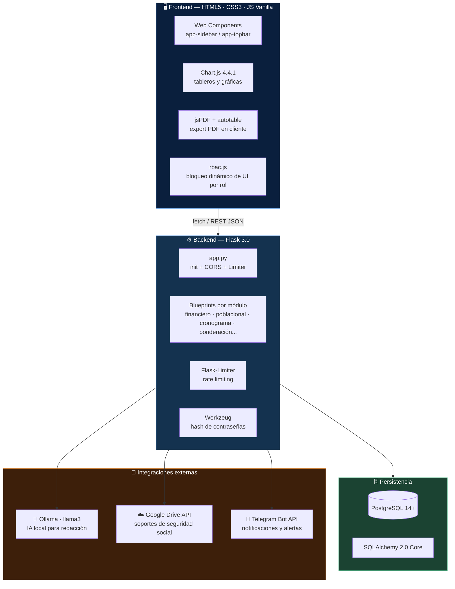
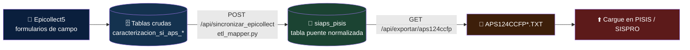
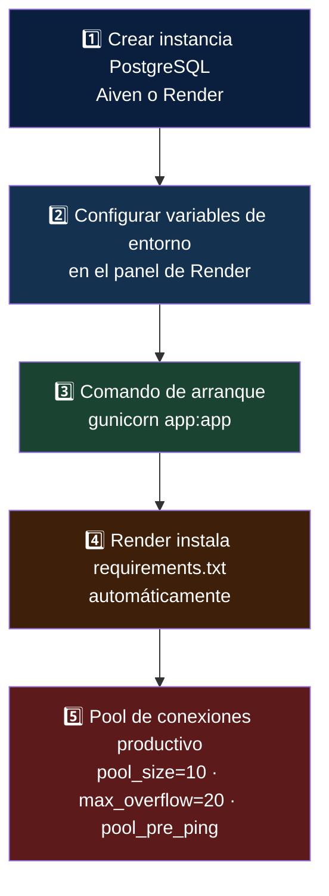

<div align="center">

### Sistema Integral de Información y Generación de Anexos PISIS (SI-APS y SER124)

Captura, valida, audita y exporta la información exigida por el **Ministerio de Salud y Protección Social** a través de la plataforma **PISIS/SISPRO**, en el marco del programa de **Atención Primaria en Salud (APS)** y los **Equipos Básicos de Salud (EBS)**.

<p>
  
  
  
  
</p>
<p>
  
  
  
  
</p>
<p>
  
</p>

</div>

---

## 📑 Tabla de contenido

- [🧱 Arquitectura tecnológica](#-arquitectura-tecnológica)
- [⚖️ Cumplimiento normativo](#️-cumplimiento-normativo)
- [🔄 Flujo de datos](#-flujo-de-datos)
- [🧭 Módulos y páginas del sistema](#-módulos-y-páginas-del-sistema)
- [🔐 Roles y control de acceso (RBAC)](#-roles-y-control-de-acceso-rbac)
- [🗂️ Estructura del repositorio](#️-estructura-del-repositorio)
- [🔑 Variables de entorno](#-variables-de-entorno)
- [🚀 Puesta en producción](#-puesta-en-producción)
- [💻 Instalación y ejecución local](#-instalación-y-ejecución-local)
- [📝 Notas de estado](#-notas-de-estado)

---

## 🧱 Arquitectura tecnológica



<details>
<summary><b>📦 Ver stack completo por capa</b></summary>

| Capa | Tecnología |
| :--- | :--- |
| Backend | Python 3.11+, Flask 3.0, Flask-CORS, Flask-Limiter |
| ORM / Driver | SQLAlchemy 2.0 (Core), psycopg2-binary |
| Config | python-dotenv |
| Seguridad | Werkzeug (`pbkdf2`/`scrypt`), tokens `secrets.token_hex`, PIN territorial de 8 dígitos |
| Reportes servidor | `fpdf` (Informe Ejecutivo), `python-docx` (Informe Mensual con IA) |
| Datos / Excel | `pandas`, `openpyxl` |
| Servidor WSGI | `gunicorn` |
| Frontend | HTML5, CSS3 modular, JavaScript vanilla, Web Components nativos |
| Gráficas | Chart.js 4.4.1 (CDN) |
| PDF en cliente | jsPDF 2.5.1 + jspdf-autotable |
| IA generativa | Ollama (modelo `llama3`, local, sin costo de API) |
| Almacenamiento de soportes | Google Drive API (cuenta de servicio) con *fallback* a Base64 en PostgreSQL |
| Notificaciones | Telegram Bot API (hilo asíncrono) |

</details>

---

## ⚖️ Cumplimiento normativo

| Norma | Alcance dentro del sistema |
| :--- | :--- |
| 📘 **Resolución 3280 de 2018** (MSPS) | Lineamientos técnicos y operativos de las RIAS; define el rol de los EBS y el enfoque de curso de vida |
| 📗 **Resolución 2026 de 2023** | Fuente de incorporación presupuestal de los recursos para conformación, dotación y sostenimiento del talento humano de los EBS |
| 📙 **Resolución 2361 de 2016** | Estructura y periodicidad de la ejecución financiera reportada (módulo SER124DREC) |
| 📕 **Resolución 0800 de 2026** (MSPS) | Recursos adicionales para EBS especializados; contexto del Informe Ejecutivo |

**Reglas técnicas del motor de exportación (`exportador_txt.py`)**, para ambos anexos:

> 🔒 Codificación **ANSI** &nbsp;·&nbsp; 🔗 Delimitador **pipe `|`** &nbsp;·&nbsp; 🧱 Registro **Tipo 1 (Control)** + **Tipo 2..N (Detalle)** &nbsp;·&nbsp; 🧹 Limpieza automática de comillas / retornos de carro / caracteres no permitidos

<table>
<tr>
<td width="50%" valign="top">

### 💰 A. Financiero — `SER124DREC`
`SER124DRECAAAAMMDDXX999999999999IDXXXXXXXXXX.txt`

| Tipo | Registro |
|:---:|:---|
| 1 | Control |
| 2 | Incorporación |
| 3 | Contratos / Actos |
| 4 | Pólizas |
| 5 | Seguimiento técnico/financiero |
| 6 | Reintegro no ejecutado |
| 7 | Reintegro de rendimientos |

`GET /api/exportar/ser124drec`

</td>
<td width="50%" valign="top">

### 👨‍👩‍👧 B. Poblacional — `APS124CCFP`
`APS124CCFPAAAAMMDDZZ999999999999.TXT`

| Tipo | Registro |
|:---:|:---|
| 1 | Control |
| 2 | Identificación Entorno/EBS |
| 3 | Caracterización de integrantes |

`POST /api/sincronizar_epicollect` → `GET /api/exportar/aps124ccfp`

</td>
</tr>
</table>

---

## 🔄 Flujo de datos

### 👨‍👩‍👧 Poblacional — de Epicollect5 a PISIS



El dashboard `/poblacional` muestra en tiempo real cuántos registros hay en Epicollect5, cuántos ya sincronizaron a `siaps_pisis` y cuántos quedan pendientes, con un endpoint de diagnóstico (`/api/debug/epicollect_columnas`) para detectar filas que se perderían por falta de identificador.

### 💰 Financiero — ejecución de recursos a PISIS


---

## 🧭 Módulos y páginas del sistema

| Ruta | Módulo | Descripción | Acceso |
| :--- | :--- | :--- | :---: |
| `/` | 📊 Dashboard General | Métricas rápidas del sistema | 🌐 Público |
| `/login` | 🔑 Login | Autenticación de usuarios | 🌐 Público |
| `/formulario_acceso` | 📝 Diligenciar Acceso | Solicitud de accesos a PISIS con adjunto de soporte | 🌐 Público |
| `/consulta_acceso` | 🔍 Consulta Autorizaciones | Administración de solicitudes de acceso | 🌐 Público / 👑 Admin |
| `/poblacional` | 📄 Poblacional (SI-APS) | ETL Epicollect5 → PISIS y exportación APS124CCFP | 👑 Admin / 🛡️ Coord |
| `/financiero` | 💰 Financiero (SER124) | Registro de ejecución y exportación SER124DREC | 👑 Admin / 🛡️ Coord |
| `/consultas` | 🔍 Auditoría (SER124) | Trazabilidad y cruce de registros financieros | 👑 Admin / 🛡️ Coord |
| `/indicadores_cobertura` | 📈 Indicadores Cobertura | Numeradores/denominadores por territorio | 🔐 PIN de 8 dígitos |
| `/indicadores_componentes` | 📈 Indicadores Componentes | Consolidado macro mensual poblacional/técnico/financiero | 👑 Admin / 🛡️ Coord |
| `/ponderacion` | 📊 Matriz de Ponderación | Evaluación de perfiles de talento humano | 👑 Admin / 🛡️ Coord |
| `/cronograma` | 📍 Cronograma (EBS) | Programación operativa y despliegue territorial | 🛡️ Coord (consulta pública) |
| `/informe` | 📈 Informe Entidades | Informe ejecutivo multianual 2024-2026, exportable a PDF | 👑 Admin / 🛡️ Coord |

---

## 🔐 Roles y control de acceso (RBAC)

Motor de RBAC en cliente (`static/js/rbac.js`) reforzado en servidor para operaciones sensibles, que bloquea dinámicamente botones, formularios y controles según el rol de sesión.

| Módulo | 👑 Administrador | 🛡️ Coordinador | 👁️ Visualizador / Público |
| :--- | :---: | :---: | :---: |
| Dashboard general | ✅ Total | ⚠️ Sin acciones críticas | 👁️ Solo lectura |
| Poblacional / Financiero | ✅ Total | 🚫 Bloqueado | 🚫 Bloqueado |
| Cronograma / Ponderación | ✅ Total | ✅ Total | 👁️ Consulta + 📄 export PDF |
| Consultas / Auditoría | ✅ Total | ✅ Total | 👁️ Consulta, sin editar/eliminar |
| Indicadores de Cobertura | ✅ Total | ✅ Total | 🔐 Requiere PIN territorial |

> 🚨 El módulo de Indicadores de Cobertura bloquea automáticamente un territorio tras **3 intentos fallidos** del PIN y dispara una alerta de seguridad por Telegram.

---

## 🗂️ Estructura del repositorio

<details>
<summary><b>📁 Ver árbol completo del proyecto</b></summary>

```text
/
├── app.py                       # Inicialización de Flask, CORS, Limiter y Blueprints
├── requirements.txt             # Dependencias de Python
├── .env                         # Variables de entorno (no versionado)
│
├── /modulos/
│   ├── Resolucion_2026.py       # Registrador central de blueprints del ecosistema 2023-2026
│   ├── rutas_vistas.py          # Enrutador de páginas HTML (vistas)
│   ├── rutas_api.py             # Auth, gestión de accesos e Indicadores (Cobertura/Componentes)
│   ├── db_config.py             # Motor SQLAlchemy: detección automática local / Render / Aiven
│   ├── acceso_db.py             # Persistencia de solicitudes de acceso + integración Google Drive
│   ├── auth_db.py               # DDL y utilidades de la tabla de usuarios
│   ├── limitador.py             # Configuración central de Flask-Limiter
│   ├── notificaciones.py        # Notificaciones push a Telegram (hilo asíncrono)
│   ├── pdf_acceso.py            # PDF de soporte de la solicitud de acceso
│   │
│   ├── financiero.py            # Blueprint + lógica de negocio SER124DREC
│   ├── poblacional.py           # Blueprint + ETL y exportación APS124CCFP
│   ├── exportador_txt.py        # Motor de generación de archivos planos Minsalud
│   ├── etl_mapper.py            # Mapeo/normalización Epicollect5 → anexo técnico (c0..c124)
│   ├── cargador_epicollect.py   # Carga masiva de formularios (Excel/CSV) a tablas 2026
│   ├── cargador_masivo.py       # Plantillas y cargue masivo genérico por tabla
│   ├── migrar_siaps_pisis.py    # DDL de la tabla puente siaps_pisis
│   ├── consultas.py             # Auditoría/consulta genérica de tablas financieras
│   ├── cronograma.py            # Blueprint del módulo de programación operativa EBS
│   ├── schema_cronograma.py     # DDL de tablas del cronograma
│   ├── schema_poblacional.py    # DDL de tablas del módulo poblacional (aps_control, etc.)
│   ├── matriz_ponderacion.py    # Blueprint de evaluación de talento humano
│   ├── db_matriz.py             # DDL de la matriz de ponderación
│   ├── db_modelos.py            # Modelos/DDL compartidos
│   ├── diario_vacunacion.py     # Lógica del diario de vacunación
│   ├── mensual.py               # Consolidados mensuales
│   ├── informe_entidades.py     # Informe ejecutivo multianual (datos + export PDF con FPDF)
│   ├── inf_financiero.py        # Extracción de KPIs financieros para el informe ejecutivo
│   ├── inf_aps2024.py / inf_aps2025.py / inf_aps2026.py   # KPIs poblacionales por vigencia
│   ├── inf_db_utils.py          # Utilidades compartidas de los extractores "inf_*"
│   └── generador_ia.py          # Redacción cualitativa vía Ollama (llama3) + generación .docx
│
├── /static/
│   ├── /css/                    # layout.css, style.css
│   ├── /js/                     # layout.js, rbac.js y un main_*.js por módulo
│   ├── /img/                    # Logos institucionales
│   └── /docs/                   # plantilla_base.docx
│
└── /*.html                      # Vistas del aplicativo (HTML5 puro + Web Components)
```

</details>

---

## 🔑 Variables de entorno

<details>
<summary><b>⚙️ Ver todas las variables usadas por el sistema</b></summary>

| Variable | Uso |
| :--- | :--- |
| `AMBIENTE` | `local` o `produccion` — selecciona la estrategia de conexión a BD |
| `RENDER` | `"true"` cuando la app corre en Render (autodetección de entorno productivo) |
| `DATABASE_URL` | Cadena de conexión completa (Render/Heroku/Aiven); normaliza `postgres://`→`postgresql://` y fuerza `sslmode=require` |
| `DB_USER_AIVEN` / `DB_PASSWORD_AIVEN` / `DB_HOST_AIVEN` / `DB_PORT_AIVEN` / `DB_NAME_AIVEN` | Conexión manual a Aiven cuando no se usa `DATABASE_URL` |
| `DB_USER` / `DB_PASSWORD` / `DB_HOST` / `DB_PORT` / `DB_NAME` | Conexión a PostgreSQL local (auto-creación de BD si no existe) |
| `PORT_INFORMES` | Puerto de escucha de Flask en local (por defecto `5050`) |
| `TELEGRAM_BOT_TOKEN` / `TELEGRAM_CHAT_ID` | Notificaciones push de registros y alertas de seguridad |
| `GOOGLE_CREDENTIALS_JSON` | Credenciales de cuenta de servicio (JSON) para subir soportes a Google Drive |

> 🤖 El motor de IA local (`generador_ia.py`) no requiere variable de entorno: apunta por defecto a `http://localhost:11434` (Ollama). Si el servicio no está disponible, retorna un mensaje de error controlado sin romper el resto de la aplicación.

</details>

---

## 🚀 Puesta en producción



> ⚠️ El servicio de **Ollama** corre en `localhost`, por lo que solo funcionará si el propio servidor de producción lo tiene instalado; si no, el módulo de generación `.docx` degrada de forma controlada sin afectar el resto del sistema.

El **entorno local**, en cambio, no requiere `DATABASE_URL`: basta con PostgreSQL corriendo y las variables `DB_*` en `.env` — `verificar_crear_bd_local()` crea la base de datos automáticamente si no existe.

---

## 💻 Instalación y ejecución local

```bash
git clone https://github.com/zhankyou/Informe_Pisis.git
cd Informe_Pisis

python -m venv venv
source venv/bin/activate      # En Windows: venv\Scripts\activate

pip install -r requirements.txt

# Crear archivo .env con al menos:
# DB_USER=postgres
# DB_PASSWORD=1234
# DB_HOST=localhost
# DB_PORT=5432
# DB_NAME=aps_local_db
# PORT_INFORMES=5050

python app.py
```

✅ La aplicación queda disponible en **`http://localhost:5050`**

---

## 📝 Notas de estado

- ⚠️ `generar_txt_siaps()` en `exportador_txt.py` es una implementación base/legada; la exportación **real y vigente** del anexo poblacional es el flujo `poblacional.py` (ETL → `siaps_pisis` → `/api/exportar/aps124ccfp`).
- 🏛️ El PDF del **Informe Ejecutivo** (`informe_entidades.py`) está parametrizado para la Empresa Social del Estado del Municipio de Villavicencio y la Honorable Asamblea Departamental del Meta; la entidad destinataria es configurable por parámetro en la petición.

---

<div align="center">
<sub>Sistema desarrollado para el programa de Atención Primaria en Salud (APS) — Equipos Básicos de Salud (EBS)</sub>
</div>
